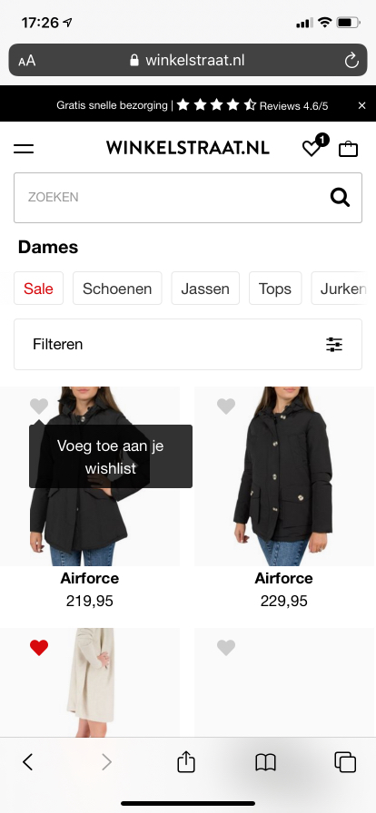

# Procesverslag
**Auteur:** -Suze Entjes-

Markdown cheat cheet: [Hulp bij het schrijven van Markdown](https://github.com/adam-p/markdown-here/wiki/Markdown-Cheatsheet). Nb. de standaardstructuur en de spartaanse opmaak zijn helemaal prima. Het gaat om de inhoud van je procesverslag. Besteedt de tijd voor pracht en praal aan je website.

## Bronnenlijst
1. www.winkelstraat.nl
2. www.w3schools.com
3. https://www.youtube.com/watch?v=kEf1xSwX5D8 (Gesproken met Bo Heins hierover)

## Eindgesprek (week 7/8)

Wat ging er goed en wat ging minder?
Deze week heeft Sam mij geholpen met het hartje boven aan de pagina. Ik wilde graag een mirco-interactie maken dat wanneer ik op het hartje druk er een 1tje boven aan de pagina komt.
Ik ben erg blij met het resultaat en ook erg blij dat dit mij gelukt is. Het lastige van JS is het uitleggen wat ik precies gedaan heb, dit is dan ook niet mijn sterke kant.

Graag wil ik even melden dat ik dit vak enorm leerzaam vond en dat ik steeds meer te begrijpen van HTML, CSS & JAVASCRIPT. Ook heb ik geleerd dat je fouten het beste kunt opsporen via inspecteren,
zo kun je de fout het snelste ontdekken. De media queries vond ik het leukste om te leren, omdat dit ervoor zorgt dat je de website responsive kunt maken.

Deze week heb ik niet echt iets negatief ervaren wat niet helemaal lukte.

**Screenshot(s):**

## Voortgang 3 (week 6)

### Stand van zaken

Wat ging er goed en wat ging minder?
Deze week heb ik mij erg veel verdiept in de puntjes op de i zetten van mijn eerste pagina en een groot deel afmaken van mijn tweede pagina.
Wat mij erg goed afging is het gebruik maken van grid om de afbeeldingen naast elkaar te krijgen naarmate de pagina groter werd.

Ik liep wel een beetje vast bij het maken van het hamburger menu. Wanneer ik mijn hamburger menu had gemaakt, werkt mijn menu voor groot scherm niet meer.
Na een aantal uren bezig te zijn geweest en hulp heb gezocht bij Sam ben ik eruit gekomen en is het mij gelukt om beide werkend te maken.

**Screenshot(s):**

Tijdens het maken van de tweede detailpagina.

De scroll functie toegevoegd wanneer het scherm kleiner wordt.

De filterfunctie is toegevoegd.

Ik heb een hover toegevoegd bij het menu wanneer mijn scherm groot is.

Mijn hamburger menu werkend

### Agenda voor meeting

-1. toelichting mediaqueries
-2. toegankelijkheid in safari (ravi)
-3. Hoe kan ik ervoor zorgen dat mijn heartbutton wanneer ik er op druk het hartjes boven aan een 1tje krijgt? (Suze)
-4. Hoe kan ik mijn navigatie uit mijn gridd krijgen (Suze)

### Verslag van meeting

Deze week zijn we naar Ravi zijn website gaan kijken hoe het is om met de tabtoets door de website te gaan.
Ook heb ik dit zelf even uitgeprobeerd en mijn website is al best tab-vriendelijk. Na de meeting geeft Sam mij
geholpen om mijn nav onder aan de pagina uit het grid te krijgen.

## Voortgang 2 (week 5)

### Stand van zaken

Wat ging er goed en wat ging minder?
Na het eerste voortgangsgesprek was ik nog best wel een beetje aan het puzzelen met mijn header indeling en toen Sam in mijn HTML ging kijken bleken er een aantal elementen niet goed te staan, waardoor mijn gehele CSS ook naar de knoppen ging. Dit zijn moment waarop ik mijn wel een beetje gefrustreerd voelde en je even wilt gaan schelden naar mijn laptop (is erg fijn ;) ).

De feedback die ik de vorige keer had gekregen had:
-1. om mijn icoontjes aan te passen naar svg's om ze te kunnen animeren.
-2. Nog even te kijken naar mijn zoekbalk, deze klopte nog niet helemaal.
-3. De afbeeldingen misschien naast elkaar doen als het scherm groter wordt, doormiddel van media queries.

Wat erg goed ging is dat ik na het puzzelen met de indeling van de header ben ik wel weer een stukje opgeschoten met het maken van mijn eerste pagina, waardoor hij al bijna af was.

**Screenshot(s):**

Dit zijn screenshots, waarbij ik de icoontjes heb veranderd in SVG's, mijn zoekbalk heb verbetert en de afbeeldingen naast elkaar heb gezet wanneer het scherm groter wordt.

### Agenda voor meeting

Deze week had iedereen weinig agendapunten. Ook ikzelf haf eigenlijk helemaal geen agendapunten, omdat ik Sam deze week veel vragen heb gesteld.
Samen met Iris, Ravi, Anne, Dianthy & Melvin hebben we deze vragen opgesteld doormiddel van een Teams meeting.

-1. meer toelichting over onzichtbare headings
-2. JS carrousel toelichting
-3. blok boven nav in header of niet (Ravi)

### Verslag van meeting

Tijdens de meeting hebben we verschillende website bekeken en daarop feedback gekregen.
Door weinig tijd heb ik niet extreem veel feedback gekregen, alleen dat ik zo moet doorgaan en dat ik een max zet op mijn tekst, zodat hij niet te breed wordt.
Ook heeft Sam een aantal dingen uitgelegd, zoals een carousel.

## Voortgang 1 (week 3)

### Stand van zaken

Wat ging er goed en wat ging minder?

Het was begonnen met HTML en CSS en ik was best wel verbaast hoe goed deze code nog in mijn hoofd zat.
De opdrachten die we over deze weken moesten maken waren best pittig, maar wel erg leuk en leerzaam. Dit heeft mij zeker geholpen bij het maken van mijn website.
De 1ste week les 1 hebben we gekeken naar een aantal voorbeelden van studenten die hun Typografie opdrachten hadden gemaakt.
De 2de week les 1 heb ik mij meer verdiept in het positioneren van elementen doormiddel van position: absolute, relative, sticky etc.
De 2de week les 2 heb heb ik mijn verdiept in flexbox, dit vond dit vorig jaar best lastig en nog steeds. Het maken van de opdracht gingen best goed.
De 3de week les 1 heb ik mijn verdiept in JS. Dit is een onderdeel wat ik best pittig vind, omdat het soms nog niet helemaal logisch is in mijn hoofd. Ook vind ik het soms lastig om het uit te leggen.

Ik begon de eerste week heel goed, maar toen ik vast liep heb ik direct contact opgenomen met Sam.
Sam zag een aantal dingetjes in mijn header die niet helemaal klopte.

**Screenshot(s):**

Voordat Sam mij had geholpen met de header

Nadat Sam mij had geholpen met de header

### Agenda voor meeting

Deze week heb ik met groep A een meeting gevolgd, omdat ik in de middag mijn propedeuse had en het daarom niet zou redden om met groep C mee te doen.
Samen met Bo en andere klasgenoten hebben wij deze punten beschreven:

-1. Hoe we kunnen zorgen dat website zo responive mogelijk worden?
-2. Moeten we het hamburger menu laten werken?
-3. Hoe kan je met 2 html pagina's en 1 css ervoor zorgen dat de nth-of-type(n) goed werkt, want als je bijvoorbeeld de eerste p op de ene html bold wilt maken, maar de eerste p op de andere html niet bold
    moet worden.
-4. Hoe kun je een caroussel maken?

### Verslag van meeting

Wij hebben ons verdiept in de verschillende aandachtspunten die ik hierboven heb beschreven.
Ik wilde zelf graag weten dat waneer ik aan een tweede pagina zou beginnen de nth-of-type goed zou werken. Joost gaf hier als antwoord op om in dit geval een classes te gebruiken.
Sam gaf ook aan dat ik een class op de body kon zetten, zodat ik niet voor elk element een andere class hoef te maken, dit heb ik dan ook gebruikt.

Joost gaf aan dat het responsive maken van de website nog later in de theorie voorkom, namelijk het gebruiken van Media Queries.
Hij had graag gewild dat dit eerder voorkwam in de theorie.

Als feedback kreeg ik van Joost mee om mijn icoontjes als svg op te slaan, zodat ik deze later nog animeren. Dit zal ik aanpassen.

## Intake (week 1)

**Je startniveau:** -kies uit zwart, rood óf blauw-

Rood

**Je focus:** -kies uit responsive óf surface plane-

Responsive en een beetje Surface plane

**Je opdracht:** -link naar de website die je gaat namaken óf de naam van je eigen ontwerp-

www.winkelstraat.nl

**Screenshot(s):**

**Breakdown-schets(en):**

